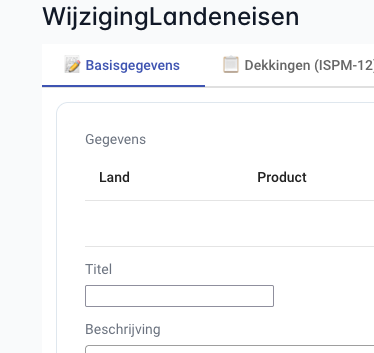

# Generation Process Architecture

This document provides a comprehensive understanding of the Ampersand prototype generation architecture, detailing how ADL interface definitions transform into deployable web applications. Software engineers creating or modifying templates require this architectural knowledge to understand the complete data flow from Ampersand scripts to user interfaces.


## 2. Data Journey: From ADL Interface to DOM

To illustrate the data journey with an example, this chapter traces a single FILTEREDDROPDOWN through each transformation step. The interface definition becomes interactive HTML through template processing and data binding.

### Step 1: ADL Interface Definition
Let's assume that `test/projects/box-filtered-dropdown/model/main.adl` contains this fragment:
```adl
INTERFACE "Box-Filtered-Dropdown tests" : "_SESSION"[SESSION] cRUd BOX<TABS>
  [ "Default": V[SESSION*Project] cRUd BOX<FORM>
      [ "1. Assign an employee (cRud)" : I BOX<FILTEREDDROPDOWN>
          [ "selectFrom"   : eligible
          , "setRelation"  : projectMember cRud
          , "emptyOption"  : TXT "- Add Project Member -"
          ]
      ]
  ]
```

### Step 2: Template with Placeholders
The annotation `<FILTEREDDROPDOWN>` in the Ampersand script specifies the use of `/proto/frontend/src/app/generated/.templates/Box-FILTEREDDROPDOWN.html`:
```html
<app-atomic-object
    [resource]="resource.$name$"
    [interfaceComponent]="this"
    [property]="resource.$name$?.setRelation"
    propertyName="setRelation"
    label="$label$"
    mode="box-filtereddropdown"
></app-atomic-object>
```
The template contains `$name$` and `$label$` placeholders.

### Step 3: Ampersand Template Processing
The command `ampersand proto --frontend-version Angular --no-backend model/main.adl --proto-dir /proto/frontend/src/app/generated` causes the Ampersand compiler to load the `FILTEREDDROPDOWN`-template. Ampersand substitutes placeholders with interface data:
- `$name$` becomes `_49__46__32_Assign_32_an_32_employee_32__40_cRud_41_` 
- `$label$` becomes `"1. Assign an employee (cRud)"`

The field name encoding converts spaces to `_32_`, numbers to ASCII codes, and parentheses to `_40_` and `_41_`, so it is a valid identifier in typescript and HTML.
It generates the following component in `/proto/frontend/src/app/generated/boxfiltereddropdowntests/boxfiltereddropdowntests.component.html`:
```html
<div class="field col-12 box-form-field">
    <label class="box-form-label">1. Assign an employee (cRud)</label>
    <div class="box-form-value">
        <app-atomic-object
            [resource]="resource._49__46__32_Assign_32_an_32_employee_32__40_cRud_41_"
            [property]="resource._49__46__32_Assign_32_an_32_employee_32__40_cRud_41_?.setRelation"
            propertyName="setRelation"
            label="1. Assign an employee (cRud)"
            mode="box-filtereddropdown"
        ></app-atomic-object>
    </div>
</div>
```
The placeholders are replaced. The interface structure is concrete Angular code.

### Step 4: Runtime Data Creation
**File**: `backend/src/Ampersand/Interfacing/InterfaceExprObject.php` (method: `getResourceContent`)

At runtime, the backend PHP reads `/proto/backend/generics/interfaces.json` metadata. The backend creates resource objects with data from the database:
```json
{
  "_id_": "project1",
  "_label_": "Project Alpha",
  "_path_": "resource/Project/project1",
  "_49__46__32_Assign_32_an_32_employee_32__40_cRud_41_": {
    "setRelation": [
      {"_id_": "m1", "_label_": "Jan Jansen"},
      {"_id_": "m4", "_label_": "Klaas Klaasen"}
    ],
    "selectFrom": [
      {"_id_": "m1", "_label_": "Jan Jansen"},
      {"_id_": "m4", "_label_": "Klaas Klaasen"},
      {"_id_": "m5", "_label_": "Anna Annasson"}
    ]
  }
}
```

### Step 5: DOM Rendering
**Browser Output**: Final rendered HTML in user's browser
```html
<div class="field col-12 box-form-field">
    <label class="box-form-label">1. Assign an employee (cRud)</label>
    <div class="box-form-value">
        <p-dropdown [options]="[Jan Jansen, Klaas Klaasen, Anna Annasson]"
                   [ngModel]="[Jan Jansen, Klaas Klaasen]"
                   placeholder="- Add Project Member -">
        </p-dropdown>
    </div>
</div>
```

The encoded property name `_49__46__32_Assign_32_an_32_employee_32__40_cRud_41_` connects the ADL interface definition to the DOM element. This encoding preserves the interface structure through all transformation steps.

Readers can trace these steps by examining the referenced files in their own test project generation.


## 3. Debugging the Flow: From Pixels to Ampersand Source

This chapter provides practical guidance for software engineers debugging and troubleshooting interface issues.
Understanding the flow from the rendered UI back to the Ampersand source code helps to analyze the root cause of problems and trace software problems back to the source code.
It creates the understanding needed to trace problems .

### 3.1 CRUD Permission Decision Tree

The CRUD flags in your ADL interface definition control how fields are rendered and what operations users can perform. Understanding this decision tree is critical for debugging "missing field" or "unexpected behavior" issues.

#### CRUD Flag Interpretation

Each position in the CRUD string controls a specific capability:
- **C** (Create): Can create new values
- **R** (Read): Can view values  
- **U** (Update): Can modify existing values
- **D** (Delete): Can remove values

**Case matters**: Uppercase = allowed, lowercase = denied

#### Component Rendering Decisions

The `atomic-alphanumeric.component.html` demonstrates how CRUD flags control rendering:

```html
<!-- Read-only: cRud (can read, cannot update) -->
<div *ngIf="canRead() && !canUpdate()">
    <ng-container *ngTemplateOutlet="cRud"></ng-container>
</div>

<!-- Editable single value: CRUD with [UNI] -->
<div *ngIf="canRead() && canUpdate() && isUni">
    <ng-container *ngTemplateOutlet="cRUdUni"></ng-container>
</div>

<!-- Editable multiple values: CRUD without [UNI] -->
<div *ngIf="canRead() && canUpdate() && !isUni">
    <ng-container *ngTemplateOutlet="cRUd"></ng-container>
</div>

<!-- Not readable: CrUD or crud -->
<div *ngIf="!canRead()">
    <ng-container *ngTemplateOutlet="crud"></ng-container>
</div>
```

#### CRUD Combinations Reference Table

| CRUD | [UNI] | [TOT] | Rendered Component | User Actions Available |
|------|-------|-------|-------------------|----------------------|
| `CRUD` | Yes | No | Single editable input field | Type, edit, clear value |
| `CRUD` | Yes | Yes | Required single input field | Type, edit (cannot clear) |
| `CRUD` | No | No | List with add/remove buttons | Add multiple values, remove any |
| `CRUD` | No | Yes | List with add button | Add values, remove (must keep ≥1) |
| `CRud` | - | - | Read-only display | View only |
| `CrUD` | Yes | - | Empty field with add button | Create new value |
| `CrUD` | No | - | Empty list with add button | Add multiple values |
| `crud` | - | - | "Field is not readable" message | None (field hidden) |
| `cRUd` | Yes | - | Editable if value exists | Edit existing, cannot create new |

#### Common CRUD-Related Issues

**Issue 1: Field Not Appearing**
```
ADL: "Title" : title crud
```
**Problem**: Lowercase 'r' means not readable
**Solution**: Change to `cRud` or `CRUD`

**Issue 2: Cannot Add Values to List**
```
ADL: "Members" : members cRud
```
**Problem**: Lowercase 'c' prevents creation
**Solution**: Change to `CRud` if users should add members

**Issue 3: Cannot Remove Value from Required Field**
```
ADL: RELATION title[Document*Title] [UNI,TOT]
Interface: "Title" : title CRUD
```
**Problem**: `[TOT]` requires at least one value
**Solution**: This is correct behavior for required fields

### 3.2 Component Lifecycle & Data Flow

Understanding the complete lifecycle helps debug timing issues and data synchronization problems.

#### The Complete Journey: From User Input to Database

```
┌─────────────────────────────────────────────────────────────────┐
│ 1. USER INTERACTION                                             │
│    User types in input field                                    │
│    ↓                                                            │
│    (input)="dirty = true"  ← Sets dirty flag                   │
└─────────────────────────────────────────────────────────────────┘
                              ↓
┌─────────────────────────────────────────────────────────────────┐
│ 2. COMPONENT EVENT HANDLING                                     │
│    User blurs field (clicks elsewhere)                          │
│    ↓                                                            │
│    (blur)="updateValue()"  ← Triggered on blur                 │
│    ↓                                                            │
│    BaseAtomicComponent.updateValue():                           │
│      - Checks if dirty flag is set                              │
│      - Transforms empty string to null                          │
│      - Extracts value or ._id_ if object                        │
└─────────────────────────────────────────────────────────────────┘
                              ↓
┌─────────────────────────────────────────────────────────────────┐
│ 3. PATCH REQUEST PREPARATION                                    │
│    interfaceComponent.patch(resource._path_, patches)           │
│    ↓                                                            │
│    AmpersandInterfaceComponent.patch():                         │
│      - Determines root resource path                            │
│      - Adjusts patch path for nested resources                  │
│      - Includes any pending patches from failed validations     │
│    ↓                                                            │
│    Patch object structure:                                      │
│    {                                                            │
│      op: 'replace',                                             │
│      path: 'propertyName',                                      │
│      value: actualValue                                         │
│    }                                                            │
└─────────────────────────────────────────────────────────────────┘
                              ↓
┌─────────────────────────────────────────────────────────────────┐
│ 4. HTTP COMMUNICATION                                           │
│    PATCH http://localhost/api/v1/resource/Type/id               │
│    ↓                                                            │
│    Request body: [patch objects]                                │
│    ↓                                                            │
│    Backend processes:                                           │
│      - Validates against business rules                         │
│      - Updates database                                         │
│      - Runs exec engine rules                                   │
│      - Recalculates derived fields                              │
│    ↓                                                            │
│    Response: PatchResponse<T> {                                 │
│      isCommitted: boolean,                                      │
│      invariantRulesHold: boolean,                               │
│      content: T  ← Updated resource data                        │
│    }                                                            │
└─────────────────────────────────────────────────────────────────┘
                              ↓
┌─────────────────────────────────────────────────────────────────┐
│ 5. RESPONSE HANDLING                                            │
│    tap((resp) => { ... })                                       │
│    ↓                                                            │
│    If resp.isCommitted:                                         │
│      - Clear pendingPatches array                               │
│      - mergeDeep(this.resource.data, resp.content)              │
│    Else:                                                        │
│      - Keep patches in pendingPatches                           │
│      - Will retry on next update                                │
└─────────────────────────────────────────────────────────────────┘
                              ↓
┌─────────────────────────────────────────────────────────────────┐
│ 6. UI UPDATE                                                    │
│    mergeDeep() strategy:                                        │
│      - Updates existing object properties in place              │
│      - Preserves object references                              │
│      - Prevents Angular from re-rendering entire component      │
│      - Maintains cursor position in input fields                │
│    ↓                                                            │
│    Angular change detection:                                    │
│      - Detects changed properties                               │
│      - Updates only affected DOM elements                       │
│      - User sees updated data                                   │
└─────────────────────────────────────────────────────────────────┘
```

#### Key Code Locations

**1. Input Binding (Template)**
```html
<!-- atomic-alphanumeric.component.html -->
<input
    type="text"
    [(ngModel)]="resource[propertyName]"
    (input)="dirty = true"
    (blur)="updateValue()"
    [required]="isTot"
/>
```

**2. Update Handler (Component)**
```typescript
// BaseAtomicComponent.class.ts
public updateValue() {
  if (!this.dirty) return;

  // Transform empty string to null value
  if (this.resource[this.propertyName] === '') {
    this.resource[this.propertyName] = null;
  }

  const val = this.resource[this.propertyName];

  this.interfaceComponent
    .patch(this.resource._path_, [
      {
        op: 'replace',
        path: this.propertyName,
        value: val?._id_ ? val._id_ : val,
      },
    ])
    .pipe(takeUntil(this.destroy$))
    .subscribe(() => {
      this.dirty = false;
    });
}
```

**3. Patch Transformation (Interface Component)**
```typescript
// AmpersandInterfaceComponent.class.ts
public patch(path: string, patches: Array<Patch | PatchValue>): Observable<PatchResponse<T>> {
  // Retarget patches to root resource for complete interface update
  let rootPath = Array.isArray(this.resource.data)
    ? new ResourcePath(this.resource.data[0]!._path_).init()
    : new ResourcePath(this.resource.data._path_);

  // Adjust patch paths
  for (const patch of patches) {
    patch.path = extra + '/' + patch.path;
  }

  return this.http.patch<PatchResponse<T>>(rootPath.toString(), patches)
    .pipe(
      tap((resp) => {
        if (resp.isCommitted) {
          mergeDeep(this.resource.data, resp.content);
        }
      })
    );
}
```

#### Why Deep Merge Instead of Replacement?

**Problem with Replacement**:
```typescript
// DON'T DO THIS:
this.resource.data = resp.content;  // Creates new object reference
```
- Angular detects object reference change
- Completely re-renders all child components
- Loses cursor position in input fields
- Loses component state (scroll position, expanded sections, etc.)

**Solution with Deep Merge**:
```typescript
// DO THIS:
mergeDeep(this.resource.data, resp.content);  // Updates properties in place
```
- Keeps same object reference
- Angular only updates changed properties
- Preserves cursor position and component state
- Better user experience

### 3.3 Interactive Debugging Walkthrough

This section walks through a complete debugging scenario from browser to ADL source code.

#### Scenario: Field "Titel" Not Appearing in UI

Let's trace the field "Titel". This is what it looks like in the browser: 



And this is the corresponding Ampersand source code:
```adl
INTERFACE WijzigingLandeneisen FOR Sectormedewerker : I[Wijziging] CRuD BOX<TABS>
  [ "📝 Basisgegevens" : I[Wijziging] BOX<FORM>
      [ "Gegevens" : I[Wijziging] cRud BOX<TABLE>
          [ "Land" : wijzigingLandcode cRud
          , "Product" : wijzigingProduct cRud
          ]
      , "Titel" : wijzigingTitel CRUD        ← Found it!
      , "Beschrijving" : wijzigingBeschrijving CRUD
      ]
  ]
```


#### Step 1: Inspect the DOM

**Action**: Open browser DevTools (F12), select Elements tab, inspect the field

**What you see**:
```html
<div class="field col-12 box-form-field">
  <label class="box-form-label">Titel</label>
  <div class="box-form-value">
    <app-atomic-alphanumeric 
        propertyname="Titel" 
        label="Titel" 
        crud="CRUD" 
        isuni="" 
        _nghost-ng-c2667519175="">
      <div _ngcontent-ng-c2667519175="" class="ng-star-inserted">
        <input _ngcontent-ng-c2667519175="" 
               type="text" 
               class="ng-pristine ng-valid ng-star-inserted ng-touched">
      </div>
    </app-atomic-alphanumeric>
  </div>
</div>
```

**Key observations**:
1. Component type: `app-atomic-alphanumeric`
2. Property name: `Titel`
3. CRUD permissions: `CRUD` (full access)
4. Multiplicity: `isuni=""` (univalent - single value)

#### Step 2: Check Component Type Selection

**Question**: Why is this `app-atomic-alphanumeric` and not another type?

**Answer**: The component type is determined by the `REPRESENT` declaration:

```adl
RELATION wijzigingTitel[Wijziging*Titel] [UNI]
```

Since there's no explicit `REPRESENT Titel TYPE ...` declaration, Ampersand assigns the default type `ALPHANUMERIC` to the concept `Titel`.

**Available atomic components**:
- `atomic-alphanumeric` ← Used for ALPHANUMERIC (default)
- `atomic-bigalphanumeric` ← Used for BIGALPHANUMERIC
- `atomic-hugealphanumeric` ← Used for HUGEALPHANUMERIC
- `atomic-integer` ← Used for INTEGER
- `atomic-float` ← Used for FLOAT
- `atomic-boolean` ← Used for BOOLEAN
- `atomic-date` ← Used for DATE
- `atomic-datetime` ← Used for DATETIME
- `atomic-password` ← Used for PASSWORD
- `atomic-url` ← Used for URL
- `atomic-object` ← Used for non-primitive types (relations to concepts)

**To change component type**, add a REPRESENT declaration:
```adl
REPRESENT Titel TYPE BIGALPHANUMERIC  -- Would use atomic-bigalphanumeric
```

#### Step 3: Examine the Template

**File**: `frontend/src/app/generated/.templates/Atomic-ALPHANUMERIC.html`

```html
<app-atomic-alphanumeric
    [resource]="resource"
    [interfaceComponent]="this"
    [property]="resource.$name$"
    propertyName="$name$"
    label="$label$"
    crud="$crud$"
    $if(exprIsUni)$isUni$endif$
    $if(exprIsTot)$isTot$endif$
></app-atomic-alphanumeric>
```

**Placeholders**:
- `$name$` → Property name (e.g., "Titel")
- `$label$` → Display label (e.g., "Titel")
- `$crud$` → CRUD permissions (e.g., "CRUD")
- `$if(exprIsUni)$isUni$endif$` → Adds `isUni` attribute if relation is `[UNI]`
- `$if(exprIsTot)$isTot$endif$` → Adds `isTot` attribute if relation is `[TOT]`

#### Step 4: Check the Network Tab

**Action**: Open DevTools → Network tab → Refresh page → Find the resource request

**Example request**:
```
GET /api/v1/resource/Wijziging/123/WijzigingLandeneisen
```

**Response structure**:
```json
{
  "_id_": "123",
  "_label_": "Wijziging 123",
  "_path_": "resource/Wijziging/123",
  "_ifcs_": ["WijzigingLandeneisen"],
  "Titel": "Example title text",
  "Beschrijving": "Example description",
  "...": "..."
}
```

**Key observation**: The property name in JSON matches the `propertyname` attribute in the DOM.

#### Step 5: Verify Component Initialization

**File**: `frontend/src/app/shared/atomic-components/BaseAtomicComponent.class.ts`

```typescript
ngOnInit(): void {
  if (!(this.propertyName in this.resource)) {
    throw new Error(
      `Property '${this.propertyName}' not defined for object in '${this.resource._path_}'. 
       It is likely that the backend data model is not in sync with the generated frontend.`
    );
  }
}
```

**What this checks**:
- The property exists in the resource object
- If not, throws a clear error message

**Common cause of this error**:
- ADL was changed but frontend wasn't regenerated
- Mismatch between backend and frontend code

**Solution**:
```bash
# Regenerate the frontend
ampersand proto --frontend-version Angular --no-backend model/main.adl --proto-dir /proto/frontend/src/app/generated
```


**Complete picture**:
1. **ADL**: `"Titel" : wijzigingTitel CRUD`
2. **Template**: `Atomic-ALPHANUMERIC.html` with placeholders
3. **Generated**: HTML with `propertyname="Titel"` and `crud="CRUD"`
4. **Component**: `AtomicAlphanumericComponent` extends `BaseAtomicComponent`
5. **Runtime**: Data fetched via API, rendered in DOM

#### Step 7: Common Debugging Checklist

Use this checklist when debugging field issues:

- [ ] **Field not visible**
  - Check CRUD flags (lowercase 'r' = not readable)
  - Check `*ngIf` conditions in component template
  - Verify role permissions in ADL interface definition

- [ ] **Field is read-only when it should be editable**
  - Check CRUD flags (lowercase 'u' = not updatable)
  - Check interface role permissions
  - Verify session role matches interface role

- [ ] **Wrong component type rendered**
  - Check REPRESENT declaration for the concept
  - Verify relation target concept
  - Check if template exists for the type

- [ ] **Data not appearing**
  - Check Network tab for API response
  - Verify property name exists in response JSON
  - Check for JavaScript errors in Console tab
  - Verify backend has data for this resource

- [ ] **Property not defined error**
  - Regenerate frontend components
  - Verify ADL interface matches generated code
  - Check backend is serving correct interface structure

### 3.4 Property Name Encoding Deep Dive

Property names with special characters are encoded to ensure validity in TypeScript, HTML, and URLs.

#### Encoding Rules

**ASCII Encoding**: Non-alphanumeric characters are converted to `_XX_` format where XX is the ASCII code

| Character | ASCII Code | Encoded As | Example Input | Example Output |
|-----------|------------|------------|---------------|----------------|
| Space | 32 | `_32_` | "Project Name" | `Project_32_Name` |
| . (period) | 46 | `_46_` | "1. First" | `_49__46__32_First` |
| ( (paren) | 40 | `_40_` | "Name (old)" | `Name_32__40_old_41_` |
| ) (paren) | 41 | `_41_` | "Name (old)" | `Name_32__40_old_41_` |
| - (dash) | 45 | `_45_` | "Sub-item" | `Sub_45_item` |
| / (slash) | 47 | `_47_` | "A/B" | `A_47_B` |
| : (colon) | 58 | `_58_` | "Type: Value" | `Type_58__32_Value` |

**Digit Encoding**: Numbers at start of identifier are also encoded

| Input | ASCII Codes | Encoded |
|-------|-------------|---------|
| "1" | 49 | `_49_` |
| "2" | 50 | `_50_` |
| "10" | 49, 48 | `_49__48_` |

#### Decoding Example

**Encoded**: `_49__46__32_Assign_32_an_32_employee_32__40_cRud_41_`

**Step-by-step decoding**:
1. `_49_` → ASCII 49 → "1"
2. `_46_` → ASCII 46 → "."
3. `_32_` → ASCII 32 → " " (space)
4. `Assign` → "Assign" (no encoding)
5. `_32_` → " "
6. `an` → "an"
7. `_32_` → " "
8. `employee` → "employee"
9. `_32_` → " "
10. `_40_` → ASCII 40 → "("
11. `cRud` → "cRud"
12. `_41_` → ASCII 41 → ")"

**Decoded**: `"1. Assign an employee (cRud)"`

#### Quick Decoding Reference

```javascript
// JavaScript decoder function (use in browser console)
function decodePropertyName(encoded) {
  return encoded.replace(/_(\d+)_/g, (match, code) => 
    String.fromCharCode(parseInt(code))
  );
}

// Usage:
decodePropertyName("_49__46__32_Assign_32_an_32_employee_32__40_cRud_41_")
// Returns: "1. Assign an employee (cRud)"
```

#### Where Encoded Names Appear

**1. Generated Component HTML**:
```html
<app-atomic-object
    [resource]="resource._49__46__32_Assign_32_an_32_employee_32__40_cRud_41_"
    propertyName="setRelation"
></app-atomic-object>
```

**2. TypeScript Component Code**:
```typescript
this.resource._49__46__32_Assign_32_an_32_employee_32__40_cRud_41_?.setRelation
```

**3. API Responses**:
```json
{
  "_id_": "project1",
  "_49__46__32_Assign_32_an_32_employee_32__40_cRud_41_": {
    "setRelation": [...],
    "selectFrom": [...]
  }
}
```

**4. Error Messages**:
```
Property '_49__46__32_Assign_32_an_32_employee_32__40_cRud_41_' not defined for object
```

**5. Network Requests**:
```
PATCH /api/v1/resource/SESSION/1
Body: [{"op": "replace", "path": "_49__46__32_Assign_32_an_32_employee_32__40_cRud_41_/setRelation", "value": "emp1"}]
```

### 3.5 Common Errors and Solutions

This section catalogs frequently encountered errors with detailed explanations and solutions.

#### Error 1: Property Not Defined

**Error Message**:
```
Error: Property 'wijzigingTitel' not defined for object in 'resource/Wijziging/123'. 
It is likely that the backend data model is not in sync with the generated frontend.
```

**Where it occurs**: `BaseAtomicComponent.ngOnInit()` or `BaseBoxComponent.ngOnInit()`

**Root cause**: The frontend expects a property that doesn't exist in the resource object returned by the API.

**Common scenarios**:
1. ADL interface was modified but frontend wasn't regenerated
2. Backend and frontend are from different versions
3.

##3. I `noca-placerrquivinfpts

FdC**f.j:Addld/v/www///fj2PmNgJSfFLOPOWNbox3.csGNf`FVmh5PvcrGvghKM-f///sj/c.-ATmd-v-Acgxgu-pndjfygd