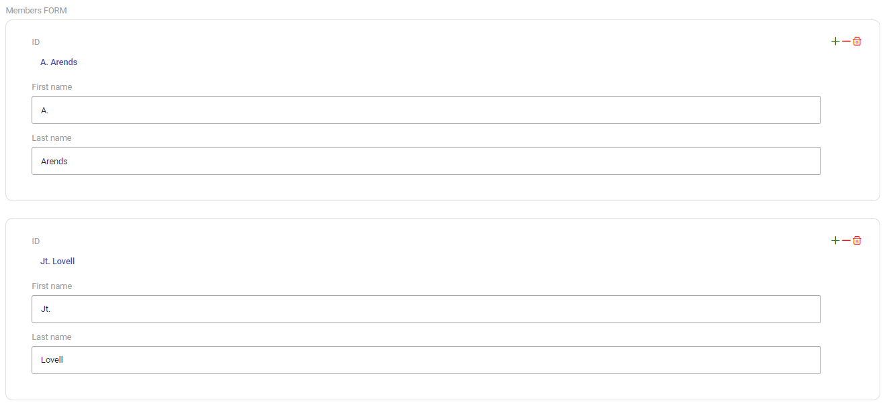
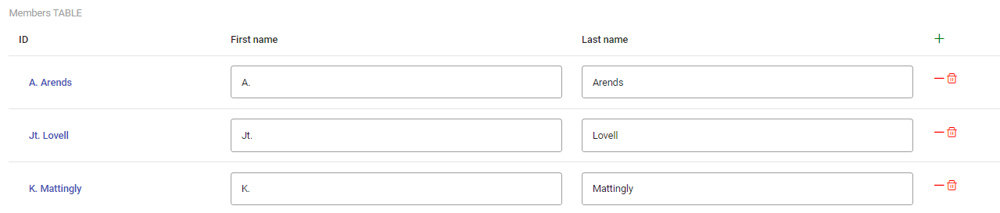
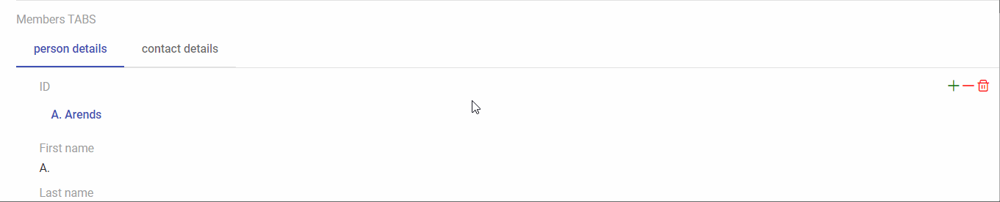
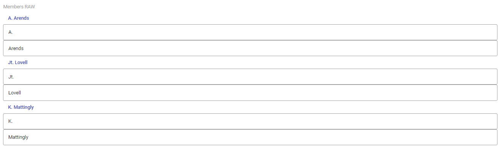

# Frontend components

Ampersand generates a web interface from your script. The interface consists of components for input, display, and navigation. This document describes which components are available and how to use them in your Ampersand script.

If you want to write your own interface templates you need to understand the underlying Angular implementation, see [Frontend Component Internals](frontend-component-internals).

## CRUD annotations

A CRUD annotation controls what operations a user may perform on a field. Each position in the four-letter string corresponds to one operation:

| Letter | Operation | Uppercase means | Lowercase means |
|--------|-----------|-----------------|-----------------|
| C | Create | User may create a new value | User may not create |
| R | Read | User may see the value | Field is not shown |
| U | Update | User may change the value | User may not change |
| D | Delete | User may delete the atom itself | User may not delete |

`CRUD` (all uppercase) allows everything. `cRud` allows only reading. `crud` (all lowercase) makes the field invisible.

**Simple relations** — A relation `r[A*B]` used on its own in an interface accepts all 16 combinations of uppercase and lowercase letters.

**Composed expressions** — A composed expression such as `r;s` or `r/\s` may only carry `cRud`, because a composed expression has no single target that the user could create, update, or delete.

### Multiplicity constraints

Two constraints on a relation affect which UI controls appear:

`[UNI]` (univalent) means that each source atom has at most one target atom. The component renders a single input field instead of a list.

`[TOT]` (total) means that each source atom must have at least one target atom. The component hides the remove button when only one value remains.


## Atomic components

An atomic component represents a single value: a piece of text, a number, a date, or a boolean. Ampersand selects the right component based on the `REPRESENT` declaration in your script.

```
REPRESENT <Concepts> TYPE <Atomic type>
```

If you declare no `REPRESENT` for a concept, Ampersand uses `ALPHANUMERIC` by default. However, if the concept is used as an interface-concept, the compiler designates it as `OBJECT`. Object atoms never change during their lifetime.

When a relation is not `[UNI]`, the user sees a list of values with add and remove controls. When a relation is `[UNI]`, the user sees a single input field.

### ALPHANUMERIC

A single-line text field for strings up to 255 characters.

```
REPRESENT ProjectName, ProjectStatus TYPE ALPHANUMERIC
```

### BIGALPHANUMERIC

A multi-line text area for strings up to 64 KB.

```
REPRESENT Description TYPE BIGALPHANUMERIC
```

### HUGEALPHANUMERIC

A full rich-text editor for strings of arbitrary length.

```
REPRESENT ArticleText TYPE HUGEALPHANUMERIC
```

### BOOLEAN

A toggle switch. The user clicks to switch between true and false.

```
REPRESENT ProjectActive TYPE BOOLEAN
```

A `BOOLEAN` relation should be `[UNI]` because a single boolean value cannot be a list.

### DATE

A date picker that opens a calendar. The value is stored in ISO 8601 format `yyyy-MM-dd`, for example `"2023-03-14"`.

```
REPRESENT ProjectStartDate TYPE DATE
```

### DATETIME

A date-and-time picker. The value is stored in ISO 8601 format `yyyy-MM-dd'T'HH:mm:ss`, for example `"2023-03-14T15:08:03+01:00"`.

```
REPRESENT ProjectStartTime TYPE DATETIME
```

### FLOAT

A numeric input that accepts decimal numbers, for example `12345` or `12345.6789`. Every integer is a valid float.

```
REPRESENT Costs TYPE FLOAT
```

### INTEGER

A numeric input that accepts only whole numbers in the range `[-2^63 .. 2^63 - 1]`.

```
REPRESENT Amount TYPE INT
```

### PASSWORD

A text field that masks the typed characters. The value is never pre-filled on screen.

```
REPRESENT Password TYPE PASSWORD
```

### Object relations

When a relation points to a concept that is not a primitive type (not ALPHANUMERIC, DATE, etc.), Ampersand renders an object selector. The user sees the label of the related object and can navigate to its interface. With `C` rights, the user can create a new object. With `D` rights, the user can delete the object from the database entirely — not just remove the link.

Remove (`U`) detaches the relation. Delete (`D`) removes the object itself and all its relations across the entire application.

```
RELATION projectMember[Project*Person] -- no REPRESENT needed; Person is an object
```

## BOX components

A BOX component creates a structured layout that contains other components. BOX components nest: a `BOX<FORM>` may contain a `BOX<TABLE>`, which in turn contains atomic fields.

A project page with a name, description, start date, and a list of members corresponds to this structure:

```
BOX<FORM>
│   ALPHANUMERIC  (project name)
│   BIGALPHANUMERIC  (description)
│   DATE  (start date)
└───BOX<TABLE>  (members)
    │   ALPHANUMERIC  (member name)
    │   ALPHANUMERIC  (member email)
```

The CRUD annotation on a BOX controls whether the user can add or remove items in that box.

### BOX\<FORM\>

Renders the contents as a vertical form with labels and fields side by side.



```
INTERFACE ProjectDetails : I[Project] cRud BOX<FORM>
  [ "Name"        : projectName        CRUD
  , "Description" : description        CRUD
  , "Start date"  : startDate          CRUD
  , "Members"     : projectMember cRud BOX<TABLE>
      [ "Name"  : memberName  cRud
      , "Email" : memberEmail cRud
      ]
  ]
```

Use `BOX<FORM>` when you want to present one object at a time with labelled fields.

### BOX\<TABLE\>

Renders the contents as a table where each row represents one item.



```
INTERFACE MemberList : "_SESSION"[SESSION]; V[SESSION*Person] cRud BOX<TABLE>
  [ "Name"  : personName  cRud
  , "Email" : personEmail cRud
  ]
```

Use `BOX<TABLE>` when you want to show a collection of items in rows.

### BOX\<TABS\>

Renders the contents as a tab bar. Each field in the box becomes a tab.



```
INTERFACE PersonCard : I[Person] cRud BOX<TABS>
  [ "Personal details" : I cRud BOX<FORM>
      [ "Name"  : personName  cRud
      , "Birth" : birthDate   cRud
      ]
  , "Contact details" : I cRud BOX<FORM>
      [ "Email" : email cRud
      , "Phone" : phone cRud
      ]
  ]
```

Use `BOX<TABS>` to organise many fields into navigable groups.

### BOX\<RAW\>

Renders the contents inside a plain `<div>` with no additional layout. Use `BOX<RAW>` when you want full control over styling through custom CSS.



### BOX\<PROPBUTTON\>

Creates a clickable button that toggles, sets, or clears a boolean property. See [Built-in BOX Templates](built-in-box-templates) for the full reference.


### BOX\<FILTEREDDROPDOWN\>

`FILTEREDDROPDOWN` is a specialised object selector that restricts the list of choices to objects that satisfy a condition. You define the condition with a separate `[PROP]` relation and reference it as `selectFrom` inside the box.

```
RELATION eligibleEmployees[Employee*Employee] [PROP]
ENFORCE eligibleEmployees := status;"eligible";status~ /\ I

INTERFACE ProjectForm : "_SESSION"[SESSION]; V[SESSION*Project] cRud BOX<FORM>
  [ "Assign employee" : projectMember cRud BOX<FILTEREDDROPDOWN>
      [ "selectFrom"  : eligibleEmployees
      ]
  ]
```

The user sees only the employees for whom `eligibleEmployees` is true. All multiplicity constraints (`[UNI]`, `[TOT]`) work as they do for regular object relations.

## VIEW components

VIEW components appear inside a `VIEW` definition. They define what the user sees when Ampersand renders a labelled value.

### PROPERTY

`PROPERTY` renders a boolean value. It uses the same toggle-switch as the `BOOLEAN` atomic component.

```
VIEW PersonView : Person
  [ "Active" : isActive PROPERTY
  ]
```

### LINKTO

`LINKTO` renders a navigable link to another interface. It uses the same object selector as a regular object relation.

```
VIEW ProjectView : Project
  [ "Owner" : projectOwner LINKTO
  ]
```

## Further reading

To understand how these components work internally — template rendering, CRUD decision trees, patch operations, and the Angular component hierarchy — see [Frontend Component Internals](frontend-component-internals).

To learn how to create a new BOX template or extend an existing one, see the [BOX Template Development Guide](../guides/box-template-development-guide).
