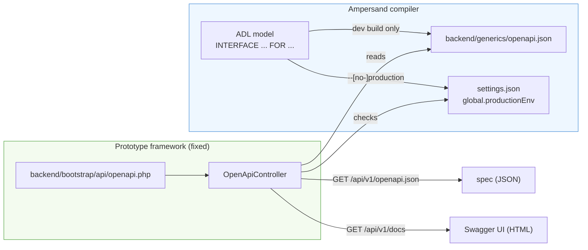

# OpenAPI Publication

This page explains, for contributors to the framework, how the prototype publishes the OpenAPI description of its REST API: which parts are generated by the compiler and which are fixed framework code, how the two stay consistent, and where the moving parts live. If you only want to *use* the description, read the guide [Using the OpenAPI Description of Your Prototype](../guides/using-the-openapi-description.md) instead.

## The contract: compiler generates, framework serves

Publication spans the [contract boundary](prototype-framework.md) between the Ampersand compiler and the framework. Each side has one job:

- **The compiler generates the spec.** For a development build it writes an [OpenAPI](https://www.openapis.org/) 3.0 document to `backend/generics/openapi.json`, next to the other generics (`interfaces.json`, `settings.json`, …). The endpoints in that document are derived from the `INTERFACE` definitions in the ADL model.
- **The framework serves the spec.** It ships fixed runtime code that reads that file and exposes it over HTTP. It never generates or edits the document.

Nothing is duplicated: the framework serves the exact bytes the compiler produced, so the published spec is current after every regeneration.



## How the routes are wired in

Two files, both fixed framework code:

**`backend/bootstrap/api/openapi.php`** registers the routes on the Slim `$api` application:

```php
$api->get('/openapi.json', OpenApiController::class . ':getSpec');
$api->get('/docs',        OpenApiController::class . ':getDocs');
```

There is no manual registration step. `backend/bootstrap/framework.php` auto-loads every route file with `glob(__DIR__ . '/api/*.php')`, so dropping a file into `backend/bootstrap/api/` is enough to register its routes. The base path of the API is `/api/v1`, so these become `/api/v1/openapi.json` and `/api/v1/docs`.

Crucially, these routes carry **no session or checksum middleware**. The global middleware stack (`InitAmpersandAppMiddleware` and friends) contains no authentication; auth and checksum checks are attached per route group. A top-level route with no group middleware is therefore **public** — which is what an API description needs to be, so that external tooling (Swagger UI, Postman, codegen) can fetch it freely.

**`backend/src/Ampersand/Controller/OpenApiController.php`** contains the logic. It extends `AbstractController` and has three private/public parts:

- `specFile()` resolves the absolute path to the spec. The controller lives in `backend/src/Ampersand/Controller/`, so `dirname(__FILE__, 4)` is the `backend` directory — both in the source tree and in the container, where `backend` is mounted at `/var/www/backend`. The generics folder sits next to it, giving `backend/generics/openapi.json`.
- `getSpec()` serves the file as `application/json` with `Access-Control-Allow-Origin: *` so tools can read it cross-origin.
- `getDocs()` serves a small self-contained HTML page that boots [Swagger UI](https://github.com/swagger-api/swagger-ui) from a public CDN and points it at `openapi.json` — a path *relative* to `/api/v1/docs`, so the browser fetches `/api/v1/openapi.json`.

### Why generics is reachable at all

The Dockerfile copies `backend/` into the image at `/var/www/backend` and moves only `backend/public/*` into the Apache docroot `/var/www/html`. So `backend/generics/` sits **outside** the docroot and is not directly reachable as a static file. Publication works precisely because the controller reads the file from PHP and writes it into an HTTP response, rather than relying on Apache to serve it.

## How publication stays consistent with the build target

The description is published only for a **development** prototype. One switch drives both sides so they can never disagree:

- The compiler flag `--[no-]production` controls the build. A production build (`--production`) omits `openapi.json` **and** sets `global.productionEnv = true` in `settings.json`. A development build does the opposite.
- The framework reads `global.productionEnv` through `AmpersandApp::inProductionMode()` (see `backend/src/Ampersand/AmpersandApp.php`).

The controller gates every request in `guardPublished()`:

```php
if ($this->app->inProductionMode() || !file_exists($this->specFile())) {
    throw new NotFoundException("OpenAPI description is not available for this prototype");
}
```

It throws a plain **404** (not a 403) on purpose, so a production prototype is indistinguishable from one where the spec was simply never generated — the endpoint reveals nothing.

Two overrides exist:

- The compiler flag `--[no-]openapi` forces spec generation on or off, independent of the build target.
- `global.productionEnv` can be overridden by `config/project.yaml` or the `AMPERSAND_PRODUCTION_MODE` environment variable (see [Configuring Development and Production Environments](../guides/configuring-environments.md)). Serving the spec in production is therefore possible, but only as a deliberate act — force the spec at build time and run with `productionEnv = false` behind your own access control.

## Files at a glance

| File | Role | Generated or fixed |
|------|------|--------------------|
| `backend/generics/openapi.json` | The OpenAPI 3.0 document | Generated (dev build only) |
| `backend/bootstrap/api/openapi.php` | Route registration, auto-loaded by glob | Fixed |
| `backend/src/Ampersand/Controller/OpenApiController.php` | Serves spec + Swagger UI, gates on production mode | Fixed |
| `backend/src/Ampersand/AmpersandApp.php` (`inProductionMode()`) | Reads `global.productionEnv` | Fixed |

## Extending it

- **Offering YAML as well** — add a `/openapi.yaml` route delegating to a new controller method. JSON is canonical and enough for virtually all tooling, so this is optional.
- **A settings-based on/off switch** — if you want to decouple publication from production mode, introduce a setting (e.g. `openapi.publish`, default `true`) and check it in `guardPublished()` alongside `inProductionMode()`.
- **Offline / air-gapped Swagger UI** — the UI currently loads `swagger-ui-dist` from a CDN, which needs browser internet access. To support offline environments, vendor `swagger-ui-dist` into the docroot and point `getDocs()` at the local assets instead of the CDN URLs.

## See also

- [Using the OpenAPI Description of Your Prototype](../guides/using-the-openapi-description.md) — the user-facing guide.
- [Prototype Framework](prototype-framework.md) — the OpenAPI publication overview sits in its settings reference, alongside the contract boundary and configuration model.
- [Configuring Development and Production Environments](../guides/configuring-environments.md) — the development/production switch in depth.
